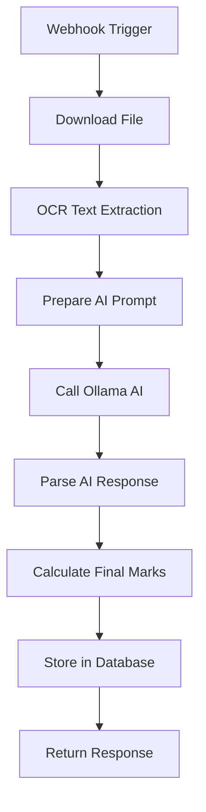

# Email Automation / Assignment Evaluation Workflow

An automated student assignment evaluation pipeline that extracts text from uploaded documents, evaluates them using local LLMs, scores them across multiple criteria, and stores results in a database.

---

## Workflow Architecture



### Nodes in Details

1. **Webhook Trigger** (`n8n-nodes-base.webhook`)
   - Listens for POST requests to `/assignment-upload`
   - Expected payload: `file_path`, `assignment_name`, `subject`
2. **Download File** (`n8n-nodes-base.httpRequest`)
   - Downloads the assignment file from the provided `file_path`
3. **OCR Text Extraction** (`n8n-nodes-base.executeCommand`)
   - Runs Tesseract OCR on the downloaded file to extract text
   - *Requires: Tesseract installed and in system PATH*
4. **Prepare AI Prompt** (`n8n-nodes-base.code`)
   - Constructs a structured JSON prompt for the AI evaluator
5. **Call Ollama AI** (`n8n-nodes-base.httpRequest`)
   - Sends the evaluation prompt to the local Ollama instance (`http://localhost:11434/api/generate`) using the `mistral` model
   - *Requires: Ollama running locally*
6. **Parse AI Response** (`n8n-nodes-base.code`)
   - Extracts and normalizes AI response into structured JSON
7. **Calculate Final Marks** (`n8n-nodes-base.code`)
   - Computes individual scores into final marks: `(correctness + completeness + grammar) / 3`
8. **Store in Database** (`n8n-nodes-base.postgres`)
   - Inserts results into the PostgreSQL `evaluations` table
   - *Requires: PostgreSQL running with proper schema*
9. **Return Response** (`n8n-nodes-base.respondToWebhook`)
   - Sends evaluation results back to the webhook caller

---

## Setup & Configuration Guide

### 1. Install System Prerequisites

#### Tesseract OCR
- **Ubuntu/Debian:**
  ```bash
  sudo apt-get update && sudo apt-get install -y tesseract-ocr
  ```
- **macOS:**
  ```bash
  brew install tesseract
  ```
- **Windows:** Download and run installer from [UB-Mannheim/tesseract](https://github.com/UB-Mannheim/tesseract/wiki)

#### Ollama (Local LLM)
1. Download Ollama from [ollama.ai](https://ollama.ai).
2. Start the daemon:
   ```bash
   ollama serve
   ```
3. Pull the default model (Mistral):
   ```bash
   ollama pull mistral
   ```

#### PostgreSQL (Database)
Create the database and initialize the schema. You can run the sql commands in [database-schema.sql](file:///c:/Users/Windows/Documents/ai%20automations%20github/workflows/email-assignment-evaluation/database-schema.sql):
```bash
psql -U postgres -d assignments -f database-schema.sql
```

---

### 2. Run n8n & Import Workflow

#### Start n8n via Docker (Recommended)
```bash
docker run -d \
  -p 5678:5678 \
  -v n8n_data:/home/node/.n8n \
  -e DB_TYPE=sqlite \
  -e WEBHOOK_URL=http://localhost:5678 \
  n8nio/n8n
```

#### Import Workflow
1. Open n8n UI at `http://localhost:5678`
2. Go to **Workflows** → **Create new**
3. Open the menu in the top-right and click **Import from file**
4. Select the corrected workflow file [email-assignment-evaluation.json](file:///c:/Users/Windows/Documents/ai%20automations%20github/workflows/email-assignment-evaluation/email-assignment-evaluation.json)
5. Configure your database connection in the **Store in Database** node
6. **Save** and **Activate** the workflow

---

## Usage Example

### Webhook Request:
```bash
curl -X POST http://localhost:5678/webhook/assignment-upload \
  -H "Content-Type: application/json" \
  -d '{
    "file_path": "https://example.com/sample_assignment.pdf",
    "assignment_name": "Cybersecurity Fundamentals",
    "subject": "Information Security"
  }'
```

### JSON Response:
```json
{
  "marks": {
    "correctness": 8,
    "completeness": 7,
    "grammar": 9,
    "final": 8.0
  },
  "feedback": "Well-structured response with minor gaps in advanced concepts.",
  "strengths": ["Clear explanation", "Good examples"],
  "weaknesses": ["Missing edge cases"],
  "keywords_found": ["encryption", "authentication", "firewall"]
}
```

---

## Troubleshooting

### Tesseract not found
If the OCR step fails saying Tesseract is not found, verify it's in your system's PATH. If it's installed in a custom location, modify the command in the **OCR Text Extraction** node to point to the absolute path:
```bash
/usr/local/bin/tesseract {{ $json.file_path }} stdout
```

### Ollama Connection Refused
Ensure the Ollama service is running. You can test it by running:
```bash
curl http://localhost:11434/api/tags
```
If you get connection refused, run `ollama serve` to start Ollama.
